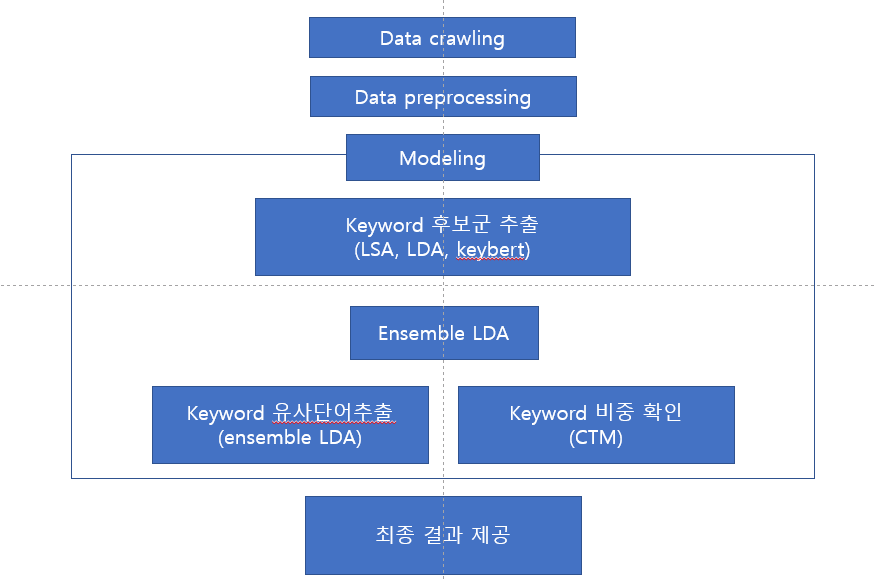
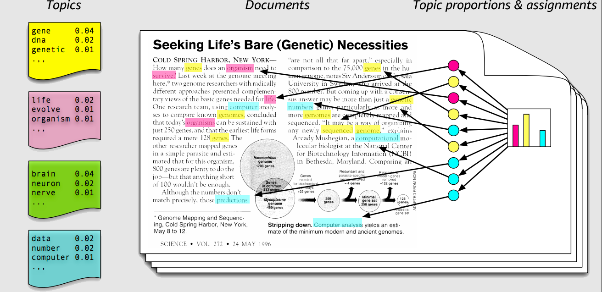

# 프로젝트 내용 정리

### **주제**

- 영화 **장르별 핵심 키워드** 추출
  - 키워드별 **중요도 파악** => LDA 스코어
  - 한 장르에서 어떤 키워드의 **중요도(비중) 파악** => 'A'의 키워드 스코어 / 모든 키워드스코어 합
  - 키워드의 **유사의미단어**(CTM)들도 제공 => 같은 키워드라도 장르간 차이 제시
  - 
- ...

흐름과 시행착오

이러이러한게 필요한데 조원소개하면 어떤 조원이 어떤걸 맡았는지

BERT란 사전학습 언어모델로 양방향학습과 마스크 언어모델, 다음문장 예측 두 문제 학습을 통해 뛰어난 성능을 보여줌

단어 모음들이 있을때 특정 단어가 어떤 확률로 등장하는지 예측하는 모델

사전학습

### 결과 분석

- 스토리, 연기와 같이 여러 장르에 걸쳐 상위에 등장하는 키워드들은 영화를 평가할때 전반적으로 사용되는
- 같은
- ...
- 장르의 특성 -> 해당장르가 갖는 특징이 실제로 키워드에 반영되었는가
- 장르간 비교
- 드라마 - (정서적인 주제를 다루는, 현실적인 등장 인물의 성격 묘사를 바탕으로 하는 영화 **장르**)
- 추출한 연관키워드의 정확도가 부족하다는 한계 존재 (개선가능성과 연결)
- 관람객들은 해당 키워드와 연관해 ~라는 키워들도 생각하고 있다

### **코드정리**

1. 데이터 수집.ipynb

2. 데이터 분석 및 전처리.ipynb
3. 모델링.ipynb
   - LSA
   - LDA1
   - LDA2
   - KeyBERT
   - CTM
   - Gensim앙상블
   - Tomotopy앙상블
4. 키워드 결과.ipynb
   - LSA / LDA1 / LDA2 / KeyBERT / CTM / **LSA,LDA,KeyBERT** / Gemsim앙상블 / **Tomotopy앙상블**
5. .ipynb

- 목차 대문자

- 데이터 로드부분 
- Coherence & Perp~ .py로 모듈화, 위치
- 모델들 순서
- 데이터 저장(positive, negative)
- 전체적인 변수네이밍(LDA tomotopy many -> Ensemble LDA (Tomotopy))
- 모델 튜닝

## **Contents**

1. ##### 프로젝트 및 수행과정 소개

   1. 프로젝트 개요
      - 프로젝트 동기
        - 
      - 관련연구
   2. 조원 소개

2. ##### 수행과정

   1. 수행과정 다이어그램
   2. 데이터 수집 및 소개
      - ...
      - 리뷰 페이지
   3. 데이터 탐색 및 전처리
      - 워드클라우드
   4. 토픽 모델링
   5. 키워드 추출 결과

3. ##### 셀프 피드백

   1. (세부내용, 시행착오들, 개선점들)

4. ##### QnA 

   1. (Reference)

## 1. **프로젝트 및 수행과정 소개**

#### **1) 팀원소개 및 역할**	

- 김준호(팀장)

  - 데이터 크롤링 코드 구현, 데이터 수집, (데이터 전처리), (자료조사), (결과분석)
- 모델 (LDA, LSA, KeyBERT, CTM) 구현
  - 키워드 결과 코드 구현
- 강석창
  
  - 데이터 수집
    - 모델 (TextRank)
- 박재현
  
    - 데이터 수집, 데이터 전처리 코드 구현
  - 모델 (Ensemble LDA)
    - PPT 발표
- 김예슬
  
    - 데이터 수집
    - PPT 제작

프로젝트 필요성

프로젝트 차별성

기존 연구들과 다르게 우리는 이렇게 바꿨더니 유의미한 키워드가 추출되었다

UI/UX 활용

~~ 위해서 했는데 **결과**는 어떻다

결과를 통한 회고  최종적으로 **결과**로 향해가야함

정말 이 결과가 중요한 의미를 갖고있는지

네이버영화나 왓챠같은 기존 서비스와 비교

#### 2) **프로젝트 개요**

- 프로젝트 의도설명
  - 기존 영화 관람할때는 
  - **프로젝트 필요성**

- 주제 선정 배경

  - **최근 금융이나 서비스업 등 다양한 분야에서 소비자 리뷰 분석을 통해 마케팅, 제품 개선 등에 이용하고 있음**

  - **관련 연구를 한번 살펴보자면,**

  - (관련 연구 사례 캡쳐)

    1. **호텔 이용자 리뷰로부터 토픽을 추출해 토픽별로 감성분석 진행한 연구**
       - 토픽 추출 후 관련 키워드 

    2. **화해라는 화장품 리퓨 어플에서 진행한 화장품 사용자 리뷰로부터 제품 속성 정보 추출하는 연구**

  - 그래서 저희가 진행할 프로젝트는 **소비자 데이터의 중요성**과 **위의 연구들에서 영감**을 얻었고,
    이를 영화분야에 적용해서 장르별로 영화 관객이 작성한 리뷰들을 모아 키워드를 찾아보는 작업입니다

  - 저희의 특징은 분석자의 **주관을 최대한 배제**하고 **데이터로부터만 키워드를 추출**하고자했습니다.

  - 이어서 많은 리뷰로부터 키워드를 추출하고 **중요한 키워드만 정리해서 제공**한다면 유용한 정보가 되고,
    기존에는 명시적으로 알기 어려웠던 **영화 장르의 특징**을 알 수 있다

  - 결과적으로 영화 제작 관계자들에게 영화 제작과 관련된 인사이트를 얻기위한 도구로 활용

  - 영화 장르별 핵심 키워드 추출

    - 온라인 리뷰에는 사용자의 피드백
    - **키워드 추출, 중요도 측정**

  - 주제 선정 배경

    - 소비자 데이터의 중요성 상기 및 영화 분야에 적용

    - 분석자의 주관을 최대한 배제하고 데이터로부터만 추출된 키워드를 보여주고자 함

    - (그래서 만약 리뷰에 쓰인 제품 속성을 추출하고 주요한 속성정보만 사용자에게 제공하면 더 좋은 고객 경험을 만들 수 있지 않을까? 그리고 추출한 제품 속성을 정량화한다면 기존에는 알기 힘들었던 제품의 특징으로 볼 수 있지 않을까?)

      

#### **3) 수행과정**

  - 수행과정 시각화
  - 

## 2. 수행과정

#### 1) **데이터 수집**

- 네이버 영화 리뷰
  - 캡쳐 (네이버 영화 -> 영화랭킹 -> 평점순 페이지 -> 장르선택)
  - 데이터 상세 (.sample(n)로 n개만 뽑아서 캡쳐)
  - (각 영화당 1000개의 리뷰 크롤링)
  - (다양한 영화 리뷰 사이트 But 리뷰 수와 크롤링 편의성 등 고려해 네이버 영화로 선정)

#### 2) 데이터 탐색 및 전처리

1. 데이터 클리닝

   - 결측치 캡쳐 -> 삭제

   - 중복리뷰 캡쳐 -> 삭제
2. 데이터 전처리

   - 키워드가 될 수 있는 명사만 추출하는 작업수행
   - 형태소 분석기 Mecab 사용(매우빠름, 세부적인 품사태깅)
   - Mecab 사용해 일반명사(NNG), 고유명사(NNP)만 추출
   - 불용어 제거, 길이 1글자 이하 리뷰 제거
   - 긍부정 레이블링(123, 8910)

#### 3) 모델링

#### 1. Topic models

- **문서 집합에서 "토픽"이라는 추상적인 주제를 찾기 위한 통계적 모델 중 하나로, 텍스트 본문의 숨겨진 의미 구조를 발견하기 위해 사용되는 텍스트 마이닝 기법입니다.**
- A topic model is a type of statistical model for discovering the abstract "topics" that occur in a collection of documents. Topic modeling is a frequently used text-mining tool for the discovery of hidden semantic structures in a text body. (paperswithcode)

최적 토픽 수 결정

coherence & perplexity

#### 1) 잠재의미분석 (LSA, Latent Semantic Analysis)

- **DTM(Document Term Matrix)를 만든 후 Truncated SVD를 통해 문서에 숨어있는 의미를 추출**
- (결과 캡쳐)
- **쉽고 빠르게 구현 가능한 장점이 있어 대략적인 인사이트를 얻는데 활용**

#### 2) 잠재 디리클레 할당 (LDA, Latent Dirichlet Allocation)

- **주어진 문서들에 대하여 각 문서에 어떤 토픽들이 존재하는지에 대한 확률모형**
- 저희가 주로 사용한 모델이며 좀 더 자세한내용은 다음페이지에서 설명
- **문서가 생성되는 과정을 확률적으로 모델링한 후 이를 추론하면서 토픽을 추정**
- 
- 다시 말해 LDA는 토픽의 단어분포와 문서의 토픽분포의 결합으로 문서 내 단어들이 생성된다고 가정합니다. LDA의 inference는 실제 관찰가능한 문서 내 단어를 가지고 우리가 알고 싶은 토픽의 단어분포, 문서의 토픽분포를 추정하는 과정입니다.

우선 글감 내지 주제를 정해야 합니다. 이후 실제 글을 작성할 때는 어떤 단어를 써야할지 결정합니다. LDA도 마찬가지입니다.
우선 말뭉치로부터 얻은 토픽 분포로부터 토픽을 뽑습니다. 이후 해당 토픽에 해당하는 단어들을 뽑습니다. 이것이 LDA가 가정하는 문서 생성 과정입니다.

이제 반대 방향으로 생각해보겠습니다. 현재 문서에 등장한 단어들은 어떤 토픽에서 뽑힌 단어들일까요? 이건 명시적으로 알기는 어렵습니다. 말뭉치에 등장하는 단어들 각각에 꼬리표가 달려있는 건 아니니까요.

- 토픽의 단어분포와 문서의 토픽분포의 결합확률이 커지도록 해야 한다
- Gemsim과 Sklearn에서 지원
- 문서 생성 가정(model)부분 Inference부분
- 문서들은 여러가지 토픽들로 표현된다
- 각 **토픽**들은 **단어의 분포**이다 (토픽은 beta를 하이퍼파라미터로 갖는 디리클레 분포)
- 각 **문서**는 **corpus-wide topic들의 혼합**이다 => 문서는 토픽의 비중(분포)의 혼합
  => corpus가 동일하다면 즉 문서집합들이 변하지않으면  각 문서의 토픽의 비중은, 토픽을 나타내는 단어들의 분포는 변하지 않는다
  => 전체문서가 (30%, 50%, 20%) 라면
- 각 **단어**들은 **토픽에 의해 생성**된다 -> 어떤 토픽에서 뽑혔는지

#### 3) KeyBERT

- **BERT를 이용해 문서와 단어를 Embedding한 후 유사도를 계산해 키워드 추출하는 방법**
- (문서의 의미적 내용을 파악해 키워드 추출 가능)
- First, document embeddings are extracted with BERT to get a document-level representation. Then, word embeddings are extracted for N-gram words/phrases. Finally, we use cosine similarity to find the words/phrases that are the most similar to the document. The most similar words could then be identified as the words that best describe the entire document.
- BERT를 이용해 문서 레벨 (document-level)에서의 주제 (representation)를 파악하도록 하고, N-gram을 위해 단어를 임베딩 합니다. 이후 코사인 유사도를 계산하여 어떤 N-gram 단어 또는 구가 문서와 가장 유사한지 찾아냅니다. 가장 유사한 단어들은 문서를 가장 잘 설명할 수 있는 키워드로 분류됩니다 (

#### 4) 복합토픽모델(CTM, Combined Topic Models)

- **빈도수 기반 문서 벡터화 방식인 Bag of Words와 사전 훈련된 언어 모델의 문서 임베딩 방식인 SBERT를 결합하여 사용하는 복합 토픽 모델**
- 

#### 5) Ensemble LDA (with Tomotopy)

- To Extracting Reliable Topics,
- LDA의 중요한 문제는 재현성(reproducibility), 처음에 랜덤으로 초기화 해주기 때문에 다시 실험했을때도 똑같은 결과가 나오
- 그래서 (모델별로 랜덤 시드를 배정해 가며), 여러개의 모델을 돌린 결과를 앙상블해 사용 

- Tomotopy로 구현
  - 기존 Gemsim이나 Sklearn같은 경우는 한개의 LDA 모델을 돌리는데 5분정도로 많은 시간소요
  - 

### 4) 키워드 결과

- ...

## 3. 셀프피드백

### 1) 세부과정(시행착오)

단일모델 별 결과를 사용하기엔 (~~결과 부족)

=> 앙상블 고려

=> LSA, LDA, KeyBERT 앙상블 결과 여전히 ~~아쉬운 결과

=> 더 많은 모델 앙상블의 필요성, 여러 번 돌릴 수 있는 LDA로 Ensemble LDA

=> (가중치 문제)로 Only LDA 앙상블로 결정

- LDA 모델 한계
  - 확률적 모델이기 때문에 실행할때마다 결과가 다르게 나오는 재현성문제 (Reproducibility)
  - 검색 결과 Gensim에서 ensemble LDA 구현되어 있음
  - but 실행시간, 

이러한 단어를 보고 이러한 요소를 알 수 있고 이런부분에 참고하여 사용할 수 있다

PPT,

코드 이해 및 정리,

결과 분석 및 해석

레퍼런스 정리

보고서

웹 마무리 (시작시 Wide 모드, 버튼 배치, 키워드마크다운 폰트색상)

코드 이해

실제로 영화를 고를때 어떤 요소를 보고 고르는지 - 배우 감독 평점 리뷰

드라마 장르라고 하면 어떤 장르인지

그러면 어떤 키워드들이 등장할것같은지
