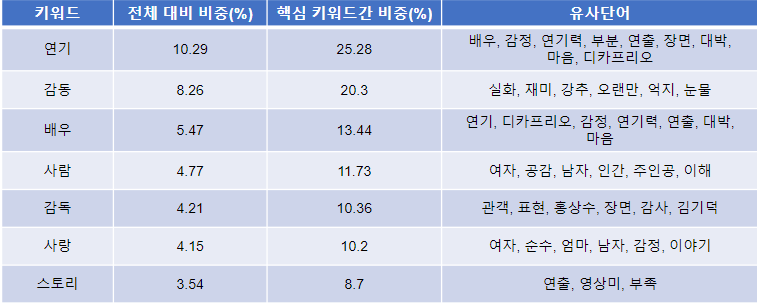

## 영화 장르별 핵심 키워드 추출

### Summary

- 영화 리뷰를 수집해 장르별로 핵심 키워드를 추출하고 결과를 시각화한 웹 서비스 개발
- 맡은 역할
  - 데이터 전처리 코드 구현
  - 모델 구현 (Ensemble LDA)
  - 결과 시각화 웹페이지 제작
  - 프로젝트 발표

- [K-Digital Training] 서비스 산업데이터를 활용한 빅데이터 분석 - 파이널 프로젝트 최우수상

**PPT에서 더 자세한 내용을 확인할 수 있습니다.**

#### 키워드 추출 결과 

- 웹페이지 링크 : https://plibi-webservice-app-1b9p2c.streamlitapp.com/

### 과정

1. 데이터 수집 및 탐색

   - 네이버 영화 <= 드라마, 판타지, 공포 등 총 17개의 장르 존재
   - 장르선택 후 각 영화별로 리뷰 1000개씩 크롤링
   - 장르별로 적으면 약 4만개, 많게는 약 81만개의 데이터
2. 데이터 전처리

   - 비어있거나 중복되는 리뷰 제거
   - 키워드가 될 수 있는 명사들만 추출 (형태소 분석기 Mecab사용)
   - 보편적으로 등장하거나 (영화제목, 관람객, 생각 등) 부사, 형용사적 의미를 갖는 명사 (정말, 진짜 등) 제거
3. 키워드 추출
   - 토픽 모델 (Topic Model)
     - 문서 집합에서 토픽이라는 주제를 찾기 위한 통계적 모델
     - 잠재의미분석(LSA), 잠재디리클레할당(LDA)
   - 텍스트 유사도 활용
     - 사전 훈련된 BERT를 활용해 임베딩 후 문서와 가장 유사한 단어 추출
     - KeyBERT, 복합토픽모델(CTM)
4. 추출 결과
   - 드라마 장르
   - 

5. 활용
   - 장르의 핵심 키워드 확인 및 의미 파악(추론)
   - 키워드 비중과 유사단어 확인
   - 웹페이지 링크 : https://plibi-webservice-app-1b9p2c.streamlitapp.com/
